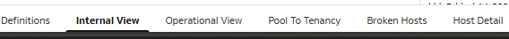
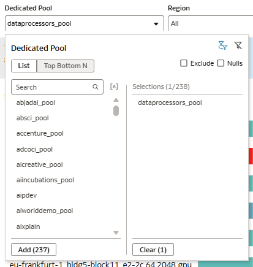
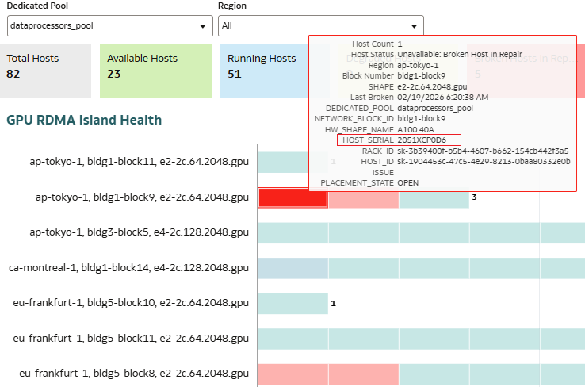
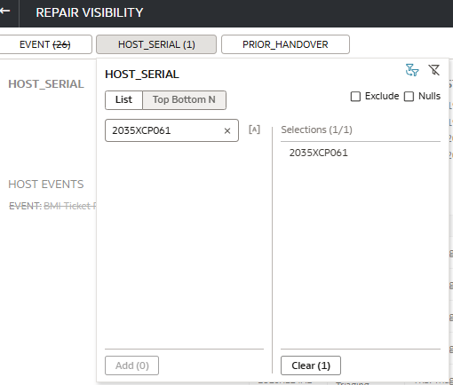
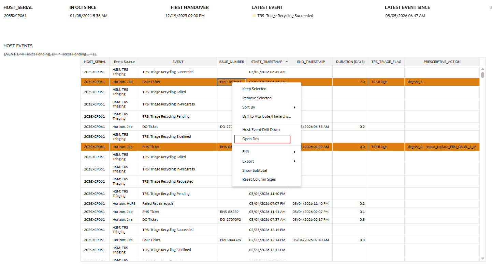
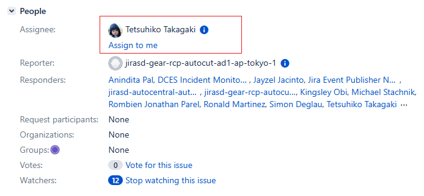

# Monitoring and chasing Host in OCI Repair-Process

## Step 1 GPU Health Dashboard

In [GPU Health Dashboard](https://horizonoac-idkzdoic6acl-ia.analytics.ocp.oraclecloud.com/ui/dv/ui/project.jsp?pageid=visualAnalyzer&reportmode=presentation&reportpath=%2F%40Catalog%2Fshared%2FCHOPS%2FProduction%2FCompute%2FGPU%20Health%20Dashboard), goes to the "Internal View" tab in bottom of screen.

## Step 2. Select the Dedicated Pool which you want to monitor

## Step 3. Get Host Serial

## Step 4. Repair Visibility Dashboard

Goes to the [Repair Visibility Dashboard](https://horizonoac-idkzdoic6acl-ia.analytics.ocp.oraclecloud.com/ui/dv/ui/project.jsp?pageid=visualAnalyzer&reportmode=full&reportpath=%2F%40Catalog%2Fshared%2FCHOPS%2FProduction%2FCompute%2FREPAIR%20VISIBILITY)

## Step 5. Put the host serial that you want to trace

## Step 6. Review the data and status for each activity

You can review the progress and right click on the ISSUE_NUMBER that you want to take a look. Then you can click "Open JIRA".

## Step 7. Review JIRA ticket and check assignee

