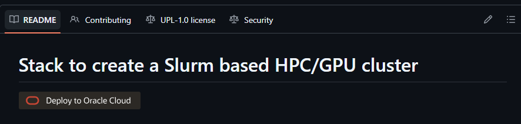
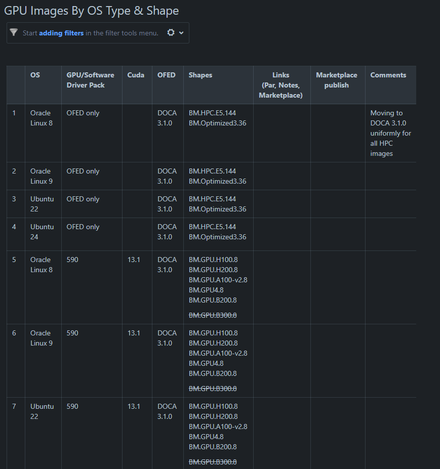
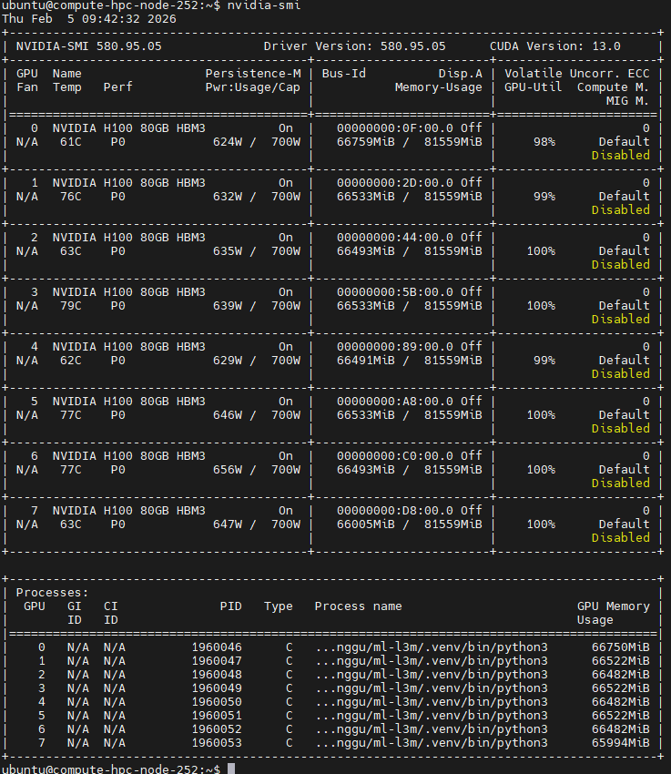
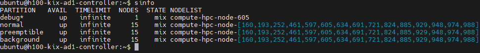
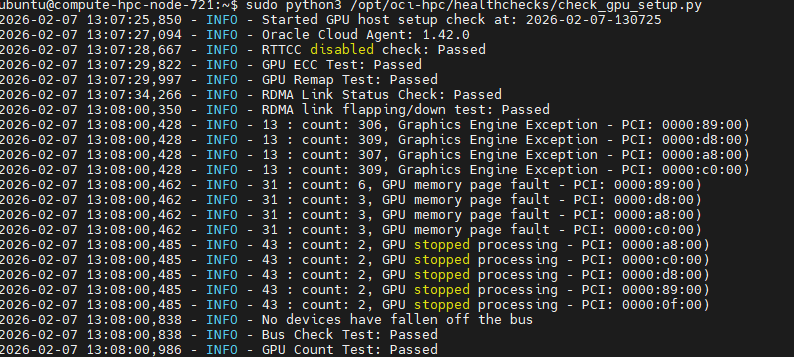

# SCE GPU Playbook

## Installation
The installation of the GPU cluster utilizes the OCI stack from the provided link: [oracle-quickstart/oci-hpc](https://github.com/oracle-quickstart/oci-hpc)



When configuring HPC + GPU clustering in OCI, the official recommendation is to use OCI-validated images. OCI performs testing and validation across OS type, compute shape, OFED, and CUDA versions, and publishes the validated images on the Confluence page as shown below. These images are updated twice a year.
[GPU Images (Feb/Mar 2026) Release - Compute - ALM Confluence](https://confluence.oraclecorp.com/confluence/pages/viewpage.action?pageId=18835757732)




## Operation

### Cluster Network Resizing (via resize.sh)

Cluster resizing refers to ability to add or remove nodes from an existing cluster network. Apart from add/remove, the resize.py script can also be used to reconfigure the nodes.

Resizing of HPC cluster with Cluster Network consist of 2 major sub-steps:

Add/Remove node (IaaS provisioning) to cluster – uses OCI Python SDK

Configure the nodes (uses Ansible)

Configures newly added nodes to be ready to run the jobs
Reconfigure services like Slurm to recognize new nodes on all nodes
Update rest of the nodes, when any node/s are removed (eg: Slurm config, /etc/hosts, etc.)

```
/opt/oci-hpc/bin/resize.sh -h
usage: resize.sh [-h] [--compartment_ocid COMPARTMENT_OCID]
                 [--cluster_name CLUSTER_NAME] [--nodes NODES [NODES ...]]
                 [--no_reconfigure] [--user_logging] [--force] [--remove_unreachable]
                 [{add,remove,remove_unreachable,list,reconfigure}] [number] [--quiet]
Script to resize the CN

positional arguments:
  {add,remove,remove_unreachable,list,reconfigure}
                              Mode type. add/remove node options, implicitly
                              configures newly added nodes. Also implicitly
                              reconfigure/restart services like Slurm to recognize
                              new nodes. Similarly for remove option, terminates
                              nodes and implicitly reconfigure/restart services like
                              Slurm on rest of the cluster nodes to remove reference
                              to deleted nodes. IMPORTANT: remove or remove_unreachable 
                              means delete the node from the cluster which means terminate 
                              the node. remove_unreachable should be used to remove specific 
                              nodes which are no longer reachable via ssh. It gives you control 
                              on which nodes will be terminated by passing the --nodes parameter.
number                        Number of nodes to add or delete if a list of
                              hostnames is not defined.

optional arguments:
  -h, --help            show this help message and exit
  --compartment_ocid COMPARTMENT_OCID
                        OCID of the compartment, defaults to the Compartment
                        OCID of the localhost
  --cluster_name CLUSTER_NAME
                        Name of the cluster to resize. Defaults to the name
                        included in the controller
  --nodes NODES [NODES ...]
                        List of nodes to delete
  --no_reconfigure      If present. Does not rerun the playbooks
  --user_logging        If present. Use the default settings in ~/.oci/config
                        to connect to the API. Default is using
                        instance_principal
  --force               If present. Nodes will be removed even if the destroy
                        playbook failed
  --ansible_crucial     If present during reconfiguration, only crucial
                        ansible playbooks will be executed on the live nodes.
                        Non live nodes will be removed
  --remove_unreachable  If present, ALL nodes that are not sshable will be terminated 
                        before running the action that was requested (Example Adding a node). 
                        CAUTION: Use this only if you want to remove ALL nodes that 
                        are unreachable. Instead, remove specific nodes that are 
                        unreachable by using positional argument remove_unreachable. 
  --quiet               If present, the script will not prompt for a response when 
                        removing nodes and will not give a reminder to save data 
                        from nodes that are being removed
```

**Add nodes** 

Consist of the following sub-steps:
- Add node (IaaS provisioning) to cluster – uses OCI Python SDK 
- Configure the nodes (uses Ansible)
  -  Configures newly added nodes to be ready to run the jobs
  -  Reconfigure services like Slurm to recognize new nodes on all nodes

Add one node 
```
/opt/oci-hpc/bin/resize.sh add 1

```

Add three nodes to cluster compute-1-hpc
```
/opt/oci-hpc/bin/resize.sh add 3 --cluster_name compute-1-hpc

```


**Remove nodes** 

Consist of the following sub-steps:
- Remove node/s (IaaS termination) from cluster – uses OCI Python SDK 
- Reconfigure rest of the nodes in the cluster  (uses Ansible)
  -  Remove reference to removed node/s on rest of the nodes (eg: update /etc/hosts, slurm configs, etc.)
 

Remove specific node:  
```
/opt/oci-hpc/bin/resize.sh remove --nodes inst-dpi8e-assuring-woodcock
```
or 

Remove a list of nodes (space seperated):  
```
/opt/oci-hpc/bin/resize.sh remove --nodes inst-dpi8e-assuring-woodcock inst-ed5yh-assuring-woodcock
```
or 
Remove one node randomly:  
```
/opt/oci-hpc/bin/resize.sh remove 1
```
or 
Remove 3 nodes randomly from compute-1-hpc:  
```
/opt/oci-hpc/bin/resize.sh remove 3 --cluster_name compute-1-hpc

```
or 
Remove 3 nodes randomly from compute-1-hpc but do not prompt for a response when removing the nodes and do not give a reminder to save data 
from nodes that are being removed :  
```
/opt/oci-hpc/bin/resize.sh remove 3 --cluster_name compute-1-hpc --quiet

```

**Reconfigure nodes** 

This allows users to reconfigure nodes (Ansible tasks) of the cluster.  

Full reconfiguration of all nodes of the cluster.   This will run the same steps, which are ran when a new cluster is created.   If you manually updated configs which are created/updated as part of cluster configuration, then this command will overwrite your manual changes.   

```
/opt/oci-hpc/bin/resize.sh reconfigure
```

## Monitoring

## Troubleshooting

### Compute Node GPU Failure

You can login to the compute node to check detailed info in order to identity the node status.
If you want to check GPU status, you can check with below command.

```
nvidia-smi
```

Below screenshot shows the output of the command. If you see the output like this, it means the GPU is working fine.



if you see error message, you need to check Slurm cluster node & partition status and the GPU status with below command.

* Slurm status

```
sinfo
```
Normal output of the command is similar to the following:



If you see there is drain state, it means the node is not available for job scheduling. You need to talk with your customer / job owner /  cluster admin to resolve this issue.

* GPU status

```
sudo python3 /opt/oci-hpc/healthchecks/check_gpu_setup.py
```
Normal output of the command is similar to the following:



if you see error message, it means the GPU is not working fine. You need to talk with your customer to remove this node from the cluster network.

## Reference
